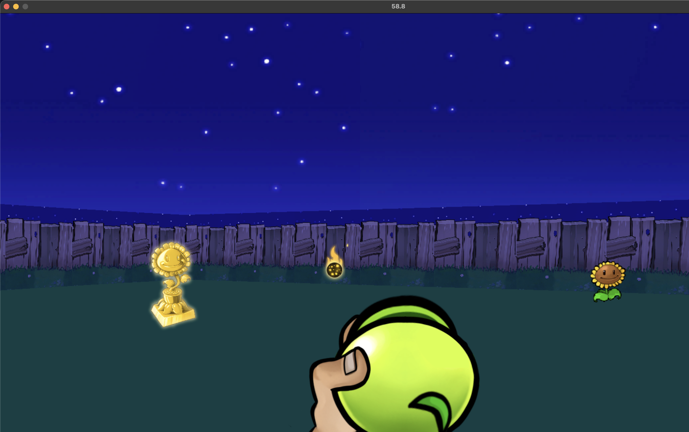
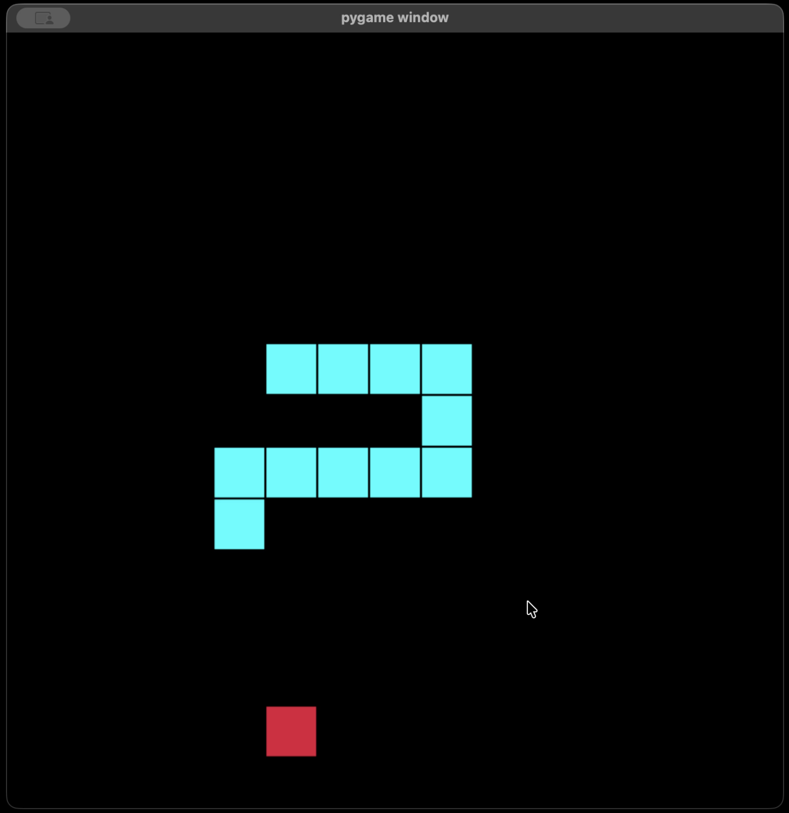
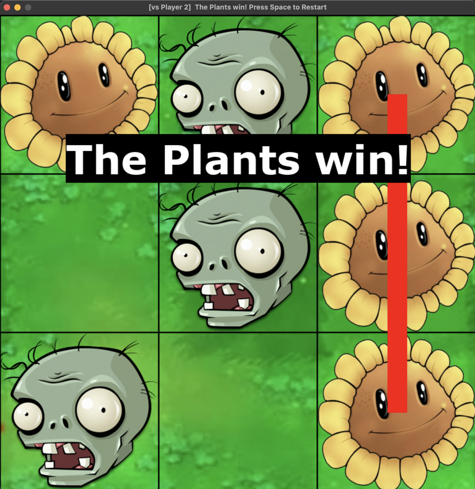
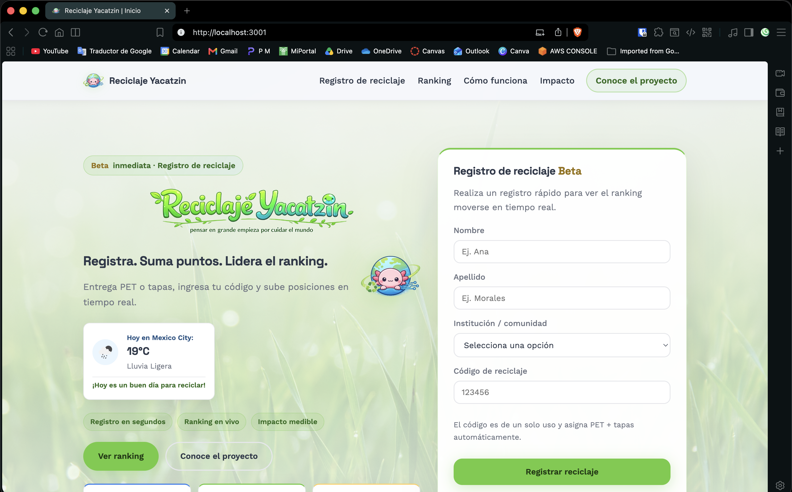

```python
class WhoAmI:
    user = "santiago-2077"
    location = "México"
    stack = ["python", "javascript", "node.js", "sqlite", "aws"]
    current_work = "construyendo cosas raras con obsesión por los detalles y demasiado pygame"

    def obsession():
        return "un tic-tac-toe normal me aburre → le meto zombies"

    def proyecto_favorito():
        return "el que sí llega a producción"

    def sobre_assets():
        return "detallista hasta el asset — la mayoría los hice a mano, tuve que aprender edición fotográfica solo para eso"
```

---

```js
const proyectos = [
  {
    nombre: "zic-pac-toe",
    desc: "tic-tac-toe clásico con estética de Plants vs Zombies",
    stack: ["python", "pygame"],
  },
  {
    nombre: "plataforma-reciclaje",
    desc: "servicio social → db relacional, API del clima, deploy real, usuarios reales",
    stack: ["node.js", "express", "sqlite", "aws ec2", "render"],
    link: "https://reciclaje-yacatzin.onrender.com",
  },
  {
    nombre: "snake-game",
    desc: "snake clásico en 60 líneas",
    stack: ["python", "pygame"],
  },
  {
    nombre: "zombiestein-3d",
    desc: "FPS con raycasting hecho desde cero, estética y assets inspirados en PvZ",
    stack: ["python", "pygame"],
  },
];
```

<table align="center">
  <tr>
    <td><a href="https://github.com/Santiago-2077/zombiestein-3D"></a></td>
    <td><a href="https://github.com/Santiago-2077/snake-game"></a></td>
    <td><a href="https://github.com/Santiago-2077/zic-pac-toe"></a></td>
    <td><a href="https://reciclaje-yacatzin.onrender.com/"></a></td>
    <td><a href="https://reciclaje-yacatzin.onrender.com/"></a></td>
  </tr>
</table>

---

<div align="center">
  
</div>
